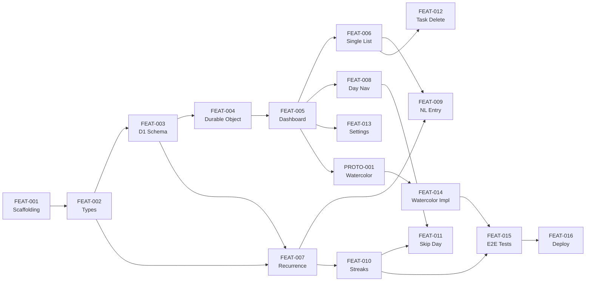

# WeDo v1

## Goal

Build and deploy WeDo v1 — a shared family daily task board for the Martin household (6 members). Ambient iPad display with real-time sync, recurring tasks with natural language entry, streaks, and a letterpress/watercolor aesthetic. Deployed on Cloudflare.

## Scope

**In scope:** Dashboard View (6 columns, completion rings, streak counts), Single List View (task toggle, NL task entry), Day Navigation (arrows, past-day editing), Recurrence Engine (RFC 5545 day codes, Sunday empty board, timezone anchor), Streak Engine (100% threshold, skip days, retroactive recalc), Real-time sync (Durable Object, WebSocket, hibernation), Task deletion, Settings (person management), Watercolor aesthetic, HARNESS scaffolding, Playwright e2e tests, Cloudflare deployment.

**Out of scope:** Streaks & Analytics view (deferred — data model supports it), authentication (trusted household), rollover tasks (v1 is no-rollover), in-app voice (device handles speech-to-text), calendar picker (arrows only), bean tracking (external — physical jars), Agents SDK conversational assistant (v2+), task editing (delete and re-create for v1).

## Success Outcomes

| ID | Outcome | Tier | Tickets |
|----|---------|------|---------|
| O-1 | Family can see today's tasks on a shared dashboard | Must | FEAT-001, FEAT-002, FEAT-003, FEAT-004, FEAT-005, FEAT-013, PROTO-001, FEAT-014, FEAT-015, FEAT-016 |
| O-2 | Family members can complete tasks and track daily progress | Must | FEAT-006, FEAT-012 |
| O-3 | Tasks recur on their scheduled days without manual re-entry | Must | FEAT-007 |
| O-4 | Tasks can be created via natural language | Should | FEAT-009 |
| O-5 | Streaks and skip days work correctly | Should | FEAT-010, FEAT-011 |
| O-6 | Day navigation lets you review and edit past days | Could | FEAT-008 |

## Context Summary

See [CONTEXT_BRIEFING.md](CONTEXT_BRIEFING.md) for the full briefing from Bridget.

Key findings: 39 library cards provide comprehensive product context. 4 ADRs (now 5) document infrastructure decisions. 15 key decisions were resolved during planning. The gap analysis identified 4 pre-implementation blockers, all now resolved: schedule_rules format (ADR 005), skip day UI (toggle on date bar), timezone (EST), task deletion (swipe/hover to trash).

## Decisions Made During Planning

| Decision | Options Considered | Chosen | Rationale |
|----------|-------------------|--------|-----------|
| schedule_rules format | RRULE string, cron, custom JSON | Custom JSON with RFC 5545 day codes | Standards-based, tool_use constrained, 3-line evaluation, zero deps (ADR 005) |
| Skip Day UI | Settings panel, long-press, date bar toggle | Toggle next to date ("SKIP TODAY") | One-tap, visible, draws line through date, dims tasks |
| Timezone | UTC, browser-local, configured | EST (America/New_York) in config | Single household, single timezone, explicit anchor |
| Task deletion | Edit mode, settings, swipe | Swipe/hover to reveal trash | Minimal gesture, consistent with mobile conventions |
| Past-day mutation path | Separate REST endpoint, same WebSocket | Same WebSocket → DO → D1 | DO doesn't care about the date — simpler, consistent |
| Sunday display | Hide board, show empty, show with dimming | Show empty board (no tasks, empty rings) | Reinforces Sabbath concept, gentle not hidden |
| Settings scope | Full settings, minimal, none | Minimal (persons, column order) | Per Radical Simplicity — just what's needed for v1 |
| WebSocket init protocol | REST endpoint, WebSocket message | WebSocket init message with date param | Same channel, no separate REST, DO responds with full state |

## Risks and Assumptions

| Type | Description | Mitigation | Tickets Affected |
|------|-------------|-----------|-----------------|
| Risk | Watercolor aesthetic may be hard to achieve in CSS/Canvas | PROTO-001 explores before committing | PROTO-001, FEAT-014 |
| Risk | iPad full-screen PWA may have sleep/wake issues | Test early, consider native wrapper if needed | FEAT-016 |
| Risk | Anthropic API latency for NL parsing may feel slow | Show loading state, optimize prompt | FEAT-009 |
| Assumption | D1 performance is sufficient at household scale | Validated by Cloudflare docs (family of 6 is trivial) | FEAT-003 |
| Assumption | Hibernatable WebSockets work reliably for ambient display | Test with extended idle periods | FEAT-004 |
| Assumption | iOS dictation is sufficient for voice entry (no in-app mic needed) | Test on iPad | FEAT-009 |

## Execution Phases

### Phase 1: Roller Skate (Must)
Dashboard renders with real data, tasks can be toggled. Proves the full vertical stack.
- FEAT-001 → FEAT-002 → FEAT-003 → FEAT-004 → FEAT-005 → FEAT-006

### Phase 2: Smart Tasks (Must + Should + Could)
Tasks recur correctly, can be created via NL, days are navigable.
- FEAT-007 (parallel with Phase 1 after FEAT-002/003)
- FEAT-008 (after FEAT-005)
- FEAT-009 (after FEAT-006 + FEAT-007)

### Phase 3: Engagement Loop (Should + Must)
Streaks, skip days, task deletion, settings.
- FEAT-010 (after FEAT-007)
- FEAT-011 (after FEAT-008 + FEAT-010)
- FEAT-012 (after FEAT-006)
- FEAT-013 (after FEAT-005)

### Phase 4: Polish & Ship (Must)
Looks beautiful, tests pass, deployed.
- PROTO-001 (after FEAT-005)
- FEAT-014 (after PROTO-001)
- FEAT-015 (after FEAT-010)
- FEAT-016 (after FEAT-015)

## Re-planning Triggers

- PROTO-001 results show watercolor aesthetic is not achievable in CSS/Canvas → consider native wrapper or different visual approach
- iPad PWA sleep/wake testing reveals dealbreakers → consider WKWebView native shell
- Anthropic API tool_use reliability is insufficient → consider fallback parsing strategy
- D1 migration issues or Drizzle ORM incompatibilities → may need raw SQL fallback

## Ticket Index

| ID | Title | Enabler | Tier | Outcome | Blocked By | Blocks |
|----|-------|---------|------|---------|------------|--------|
| FEAT-001 | Project scaffolding and HARNESS infrastructure | false | must | O-1 | — | FEAT-002+ |
| FEAT-002 | Shared Zod types and WebSocket message protocol | false | must | O-1 | FEAT-001 | FEAT-003+ |
| FEAT-003 | D1 schema, migrations, and seed data | false | must | O-1 | FEAT-002 | FEAT-004, FEAT-007+ |
| FEAT-004 | Durable Object with WebSocket init and broadcast | false | must | O-1 | FEAT-003 | FEAT-005 |
| FEAT-005 | Dashboard View with real data via WebSocket | false | must | O-1 | FEAT-004 | FEAT-006+ |
| FEAT-006 | Single List View with tap-to-toggle | false | must | O-2 | FEAT-005 | FEAT-009, FEAT-012 |
| FEAT-007 | Recurrence Engine with timezone anchor and Sunday handling | false | must | O-3 | FEAT-002, FEAT-003 | FEAT-009, FEAT-010 |
| FEAT-008 | Day Navigation with arrow-based browsing | false | could | O-6 | FEAT-005 | FEAT-011 |
| FEAT-009 | NL task entry via Anthropic API | false | should | O-4 | FEAT-006, FEAT-007 | — |
| FEAT-010 | Streak Engine with dashboard display | false | should | O-5 | FEAT-007 | FEAT-011, FEAT-015 |
| FEAT-011 | Skip Day toggle with visual dimming | false | should | O-5 | FEAT-008, FEAT-010 | — |
| FEAT-012 | Task deletion via swipe or hover | false | must | O-2 | FEAT-006 | — |
| FEAT-013 | Settings screen for person management | false | must | O-1 | FEAT-005 | — |
| PROTO-001 | Watercolor aesthetic prototype | prototype | must | O-1 | FEAT-005 | FEAT-014 |
| FEAT-014 | Watercolor aesthetic implementation | false | must | O-1 | PROTO-001 | FEAT-015 |
| FEAT-015 | Playwright e2e test suite | false | must | O-1 | FEAT-010, FEAT-014 | FEAT-016 |
| FEAT-016 | Deploy to Cloudflare | false | must | O-1 | FEAT-015 | — |

## Library Updates

See [library-updates.md](library-updates.md).

## Deferred

- Streaks & Analytics view — data model supports it, UI deferred to post-v1
- Authentication — add at Worker layer when needed
- Rollover tasks — new task type, post-v1
- In-app voice recording — device dictation is sufficient for v1
- Calendar picker — arrows only for v1
- Bean tracking in-app — physical jars for now
- Agents SDK conversational assistant — v2+
- Task editing — delete and re-create for v1
- Recurrence visualization — needs prototyping post-v1
